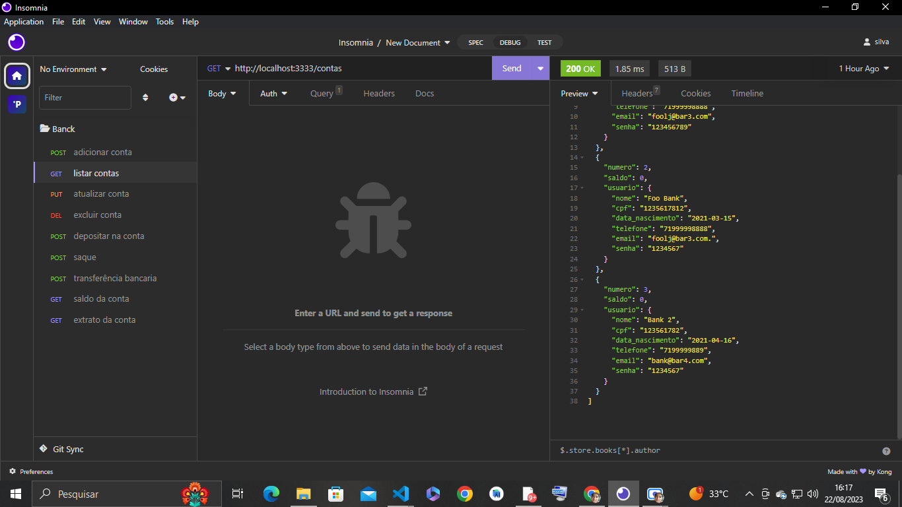

# CRUD-contas-Bancarias!
 
 

### Table of Contents
**[Sobre](#sobre)** 
**[Operações de CRUD](#operações-de-crud)** 
    *[-- CREATE](#create)* 
    *[-- READ](#read)* 
    *[-- UPDATE](#update)* 
    *[-- DELETE](#delete)* 

    ## Sobre:

Sistema de gerenciamento de contas com operações de <strong>CRUD</strong> e <strong>geração de relatórios</strong>

  
   
### Operações de CRUD:

  #### [READ](consultar.php "Código da operação")
  
Ao entrar no sistema, a página de consulta é aberta exibindo todos as contas armazenadas no banco de dados, com seus devidos atributos:

   

   
  #### [CREATE](adicionar.php "Código da operação")
  
Clicando em adicionar conta, a página do body é exibida. Nela, o usuário pode cadastrar novas contas em banco de dados.

  
   

   
  
Ao clicar no botão "adicionar", a nova conta com suas respectivas características é salva no banco de dados se o usuário clicar de volta na página de consulta, exibirá as informações atualizadas.

   
  #### [UPDATE](./php_action/update.php "Código da operação")
  
Clicando no botão de edição, a página de edição é aberta e o usuário pode editar o conteúdo dos atributos da conta respectiva se o mesmo for o titular:

  

  
  
Ao clicar em atualizar, as alterações são salvas no banco de dados e as novas informações do usuário, exibirá atualizadas.

  
  #### [DELETE](./php_action/delete.php "Código da operação")
  
Clicando em deletar conta, tem que adicionar um numero de conta no parametro da rota para a verificação se a conta e existente se a mesma for é exigida a senha para assim ocorrer a exclusão da respectiva conta.

  
  

  
 Se novamente listar as contas a mesma estará excluida do banco de dados.

  
 como se trata de contas bancarias tambem e nescessario ter as respectivas caracteristicas listadas a baixo:

    

### Depósitar 

### Sacar 

### Transferir valores entre contas bancárias

### Consultar saldo da conta bancária

### Emitir extrato bancário

 

